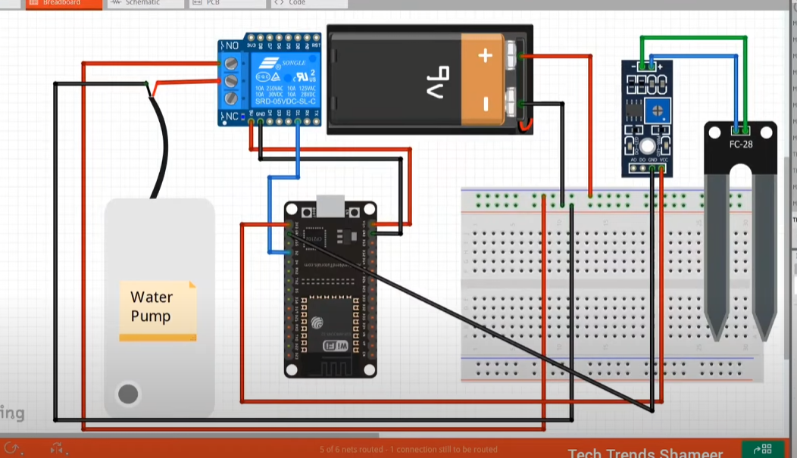

# 🌿 Smart Irrigation System using ESP32

This is a smart irrigation system built using ESP32, soil moisture sensor, and a relay-controlled water pump. The project uses the **Blynk IoT platform** to monitor soil moisture levels and automate watering, saving time and water.

---

## 🔧 Components Used
- ESP32 Development Board
- Soil Moisture Sensor
- Relay Module
- Water Pump
- Jumper Wires
- Power Supply (5V or 12V)
- Breadboard
- Smartphone with Blynk App

---

## ⚙️ Features
- Real-time soil moisture monitoring
- Auto/manual watering control via Blynk
- Relay-based water pump activation
- Smartphone interface for live monitoring

---

## 📱 How It Works
1. Soil moisture is measured using the sensor.
2. If moisture is below a threshold, the ESP32 triggers the relay to turn on the water pump.
3. The Blynk app shows live moisture data and allows manual control of watering.
4. Once the moisture level is sufficient, the pump turns off automatically.

---

## 🖼️ Circuit Diagram

---

## 📁 Files Included
- `main_code.ino` – Arduino sketch for ESP32 logic
- `components.txt` – List of required components
- `circuit_diagram.png` – Schematic image
- `README.md` – Project details

---

## ✅ Future Improvements
- Add DHT11/22 sensor for temperature and humidity
- Add water level detection in tank
- Use solar power for pump system
- Add notification feature in app
